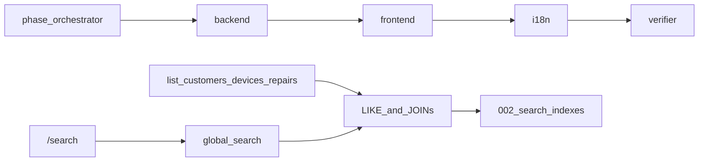

# Phase 7 — Search (global + multi-field + indexes)

**Context:** Phases 0–6 done (repairs domain + keyboard intake). Roadmap: [Phase 7 — Search](../docs/roadmap.md): DB-side multi-field search + indexes.

**Locked choices:**

| Choice | Decision |
| --- | --- |
| Surface | **Both:** deepen list filters **and** a simple global `/search` page |
| Engine | **Expanded `LIKE` + JOINs + B-tree indexes** (not FTS5) |
| Why not FTS5 now | Workshop lookups are mostly phone / serial / repair-number substrings; FTS5 tokenizers fight punctuation. Existing repos already use escaped `LIKE`. Phase 13 can add FTS5 if measurements show need. |
| Agent split | `/phase-orchestrator` → `/backend` → `/frontend` → `/i18n` → `/verifier` |

## Current gaps

| Area | Today | Phase 7 target |
| --- | --- | --- |
| Customers | name, phone, email | Same fields (already multi-field) + indexes on phone/email |
| Devices | type, manufacturer, model, serial | Same + indexes on manufacturer/model |
| Repairs | **`repair_number` only** (UI overclaims) | Number + `reported_problem` + customer name/phone + device serial/manufacturer/model |
| Global | None | `/search` + `global_search` command |
| Indexes | FK/status/name/serial only (`001_initial.sql`) | Migration `002_search_indexes.sql` |

## Architecture



## Locked IPC

### Deepen existing lists (same command names)

- `list_customers` / `list_devices` — keep field sets; ensure escaped LIKE + tests cover multi-field.
- `list_repairs` — expand text `query` to match (OR):
  - `repairs.repair_number`
  - `repairs.reported_problem`
  - joined `customers.name`, `customers.phone`
  - joined `devices.serial_number`, `devices.manufacturer`, `devices.model`
  - Keep filters: `customerId`, `deviceId`, `status`, pagination
  - Default: exclude archived repairs (`archived_at IS NULL`)

### New command: `global_search`

```ts
// invoke("global_search", { query: GlobalSearchQuery })
type GlobalSearchQuery = {
  query: string;       // required, trimmed; empty → empty result
  limitPerType?: number; // default 10, max 25
};

type GlobalSearchResult = {
  customers: Customer[];
  devices: Device[];
  repairs: Repair[]; // same Repair DTO as list_repairs
};
```

Backend applies the **same field rules** as the deepened list queries (no ranking; order: customers by name, devices by `updated_at DESC`, repairs by `received_at DESC`). Archived customers/devices/repairs excluded from global results.

## Implementation

### 1. Branch / process

- Branch `phase-7` from merged `phase-6` (after #7/#8 land as needed).
- Parent coordinates; specialists implement.

### 2. Backend (`/backend`)

- Migration `src-tauri/migrations/002_search_indexes.sql`:
  - `idx_customers_phone`, `idx_customers_email`
  - `idx_devices_manufacturer`, `idx_devices_model`
  - `idx_repairs_repair_number` (if not covered enough by UNIQUE alone for planners)
  - `idx_repairs_reported_problem` (optional; LIKE still limited — include for prefix experiments / future)
- Shared escape helper if not already centralized (trim + escape `\`, `%`, `_`).
- Update `src-tauri/src/domain/repairs/repository.rs` list SQL with JOINs + multi-field OR.
- New domain module or `domain/search/`: `global_search` service + repository queries (3 capped queries, one read connection).
- Command `global_search` registered in `src-tauri/src/lib.rs`.
- Tests: repair list finds by phone/serial/problem; global_search returns mixed hits; empty query returns empty; archived excluded.

### 3. Frontend (`/frontend`)

- Feature `src/features/search/`: api, hook `useGlobalSearch`, page with one search field + three result sections (customers / devices / repairs) linking to detail routes.
- Route `/search` in `src/routes.ts`; AppShell nav item **Search**.
- Optional shortcut later — **out of scope** (no new menu item unless trivial); Home can link to Search.
- Update repair list placeholder i18n to match real fields (already says customer/device — keep after backend catches up).
- Reuse existing table/link patterns; thin page, named components (`SearchResults`, `SearchResultSection`).

### 4. i18n (`/i18n`)

- `nav.search`, `search.title`, `search.subtitle`, `search.placeholder`, section headers, empty states — `en` / `es` / `de`.

### 5. Verify (`/verifier`)

- `cargo test`, `npm run typecheck`, `npm run lint`, `npm run build`
- Smoke: repair list by phone/serial; `/search` mixed results; empty query.

## Out of scope

- SQLite FTS5 / ranking / highlighting (Phase 13 candidate)
- Diagnosis templates, images, printing
- Changing intake comboboxes beyond benefiting from deeper `list_*` (they already use list APIs)
- Synthetic load tests (Phase 13)

## Todos

1. Create `phase-7` branch from merged `phase-6`
2. `/phase-orchestrator`: lock `global_search` IPC + repair multi-field contract
3. `/backend`: migration 002 indexes, deepen `list_repairs`, `global_search` + tests
4. `/frontend`: `/search` feature, nav, wire `global_search`
5. `/i18n`: search nav + page strings en/es/de
6. `/verifier`: cargo test + typecheck/lint/build; 12-point report STOP

## Stop line

12-point Phase 7 report → **STOP**. PR: `phase-7` → `phase-6`.
