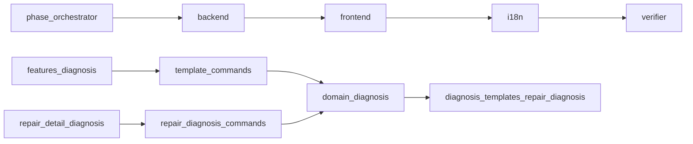

# Phase 8 — Diagnosis templates

**Context:** `staging` has Phases 0–7 + Servioo branding. Roadmap next: [Phase 8 — Diagnosis templates](../docs/roadmap.md). Tables already exist in `001_initial.sql`; no feature code yet. Images stay Phase 9.

## Locked product choices

| Choice | Decision |
| --- | --- |
| Template storage | Existing `diagnosis_templates` (`name`, `body_json`, `updated_at`) |
| Applied diagnosis | Existing `repair_diagnosis` (`repair_id`, `template_id`, `result_json`) |
| Checklist shape | Ordered items: `{ id, label, kind }` where `kind` is `checkbox` or `text` |
| Result shape | Same items plus `value` (`boolean` for checkbox, `string` for text) |
| Per repair | **At most one** diagnosis — enforce in Rust; migration `003` adds `UNIQUE(repair_id)` |
| Template delete | Hard delete only if unused; if referenced → validation error |
| Apply flow | On repair detail: pick template → copy snapshot into `result_json` (labels frozen even if template later edits) |
| Status | Applying a template does **not** auto-change repair status |
| Agent split | `/phase-orchestrator` → `/backend` → `/frontend` → `/i18n` → `/verifier` |

### Locked JSON (examples)

Template `body_json`:

```json
{
  "items": [
    { "id": "screen", "label": "Screen intact", "kind": "checkbox" },
    { "id": "notes", "label": "Technician notes", "kind": "text" }
  ]
}
```

Result `result_json` (after apply + fill):

```json
{
  "items": [
    { "id": "screen", "label": "Screen intact", "kind": "checkbox", "value": false },
    { "id": "notes", "label": "Technician notes", "kind": "text", "value": "Hairline crack" }
  ]
}
```

## Architecture



## Implementation

### 1. Branch / process

- Branch `phase-8` from current `staging`.
- Parent coordinates; specialists implement.

### 2. Backend (`/backend`)

**Migration** `003_diagnosis_unique_repair.sql`:

- `CREATE UNIQUE INDEX idx_repair_diagnosis_repair_id ON repair_diagnosis(repair_id);`
- Optional: `idx_diagnosis_templates_name` on `name`

**Domain** `src-tauri/src/domain/diagnosis/`:

| Command | Behavior |
| --- | --- |
| `list_diagnosis_templates` | Optional `query` on name; pagination |
| `get_diagnosis_template` | By id |
| `create_diagnosis_template` | Validate name + body items |
| `update_diagnosis_template` | Same validation; bump `updated_at` |
| `delete_diagnosis_template` | Fail if any `repair_diagnosis.template_id` references it |
| `get_repair_diagnosis` | By `repairId`; return null when none |
| `upsert_repair_diagnosis` | `repairId`, optional `templateId`, result items |

When **applying** a template from UI: frontend loads template, maps items to default values (`false` / `""`), calls `upsert_repair_diagnosis` with `templateId`.

Register commands in `lib.rs`. Tests for CRUD, delete-blocked-when-used, upsert uniqueness, invalid kind/value.

### 3. Frontend (`/frontend`)

**Templates admin** — `src/features/diagnosis/`:

- Routes: `/diagnosis-templates`, `/diagnosis-templates/new`, `/diagnosis-templates/:id/edit`
- List + form editor: name + dynamic item list
- AppShell nav item for templates

**On repair detail**:

- Section `RepairDiagnosisSection`: checklist or empty state
- Actions: apply template → upsert; edit values + save

### 4. i18n (`/i18n`)

Nav + `diagnosis.*` strings — `en` / `es` / `de`.

### 5. Verify (`/verifier`)

`cargo test`, `npm run typecheck`, `lint`, `build`; smoke template CRUD + apply on a repair.

## Out of scope

- Images / camera (Phase 9)
- Auto status → `diagnosis` on apply
- Multi-diagnosis history per repair
- Rich item types (number, select, photo)
- Printing diagnosis onto A4 (Phase 11)
- Seed default templates

## Todos

1. Create `phase-8` branch from `staging`
2. `/phase-orchestrator`: lock IPC + JSON checklist contract
3. `/backend`: migration 003, diagnosis domain, commands, tests
4. `/frontend`: template CRUD + repair detail diagnosis section
5. `/i18n`: diagnosis strings en/es/de
6. `/verifier`: checks + 12-point report STOP

## Stop line

12-point Phase 8 report → **STOP**. PR: `phase-8` → `staging`.
