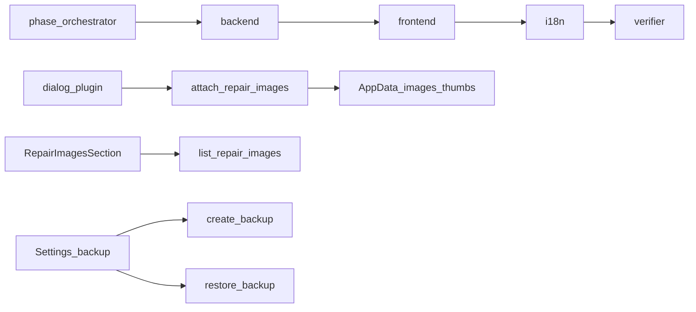

# Phases 9–10 — Images + Backup/restore

**Context:** Phases 0–8 done (diagnosis on repairs). Combined delivery per explicit approval. Roadmap: [Phase 9 — Images](../docs/roadmap.md), [Phase 10 — Backup and restore](../docs/roadmap.md). Design: [docs/backup.md](../docs/backup.md), AppData layout in [docs/database.md](../docs/database.md).

**Agent split:** `/phase-orchestrator` → `/backend` → `/frontend` → `/i18n` → `/verifier`

## Locked defaults

### Images

| Choice  | Decision                                                                                 |
| ------- | ---------------------------------------------------------------------------------------- |
| Capture | Disk file picker only — **no webcam**                                                    |
| Formats | JPEG / PNG                                                                               |
| Limits  | Max **10 MB** per file; max **30** images per repair                                     |
| Storage | Relative under AppData: `images/{repair_id}/{uuid}.ext`, `thumbs/{repair_id}/{uuid}.jpg` |
| Thumbs  | ~320px max edge, JPEG, generated in Rust off UI thread                                   |
| Schema  | Existing `repair_images` — **no migration**                                              |
| UI      | Repair detail gallery: lazy thumbs, full view, caption, delete (row + files)             |

### Backup

| Choice     | Decision                                                                                          |
| ---------- | ------------------------------------------------------------------------------------------------- |
| Package    | ZIP named `Servioo-YYYY-MM-DD-HHmm.backup`                                                        |
| Contents   | `manifest.json` + WAL-safe `database.sqlite` (rusqlite Online Backup API) + `images/` + `thumbs/` |
| Restore    | Validate → **safety backup** of current data → replace → reopen `DbState`                         |
| Auto       | `backups/auto/`, retain **14** dailies + latest pre-restore safety                                |
| Encryption | Deferred (Phase 12 / ADR 004)                                                                     |

## Out of scope

Webcam · cloud sync · encrypted backups · print reports · installer AppData retention · soft-delete recycle bin

## Architecture



## Locked IPC

All command args use camelCase (`rename_all = "camelCase"` where needed). DTOs use serde `camelCase`.

### Images

```ts
// list_repair_images { repairId }
// attach_repair_images { input: AttachRepairImagesInput }
// update_repair_image { id, input: UpdateRepairImageInput }
// delete_repair_image { id }
// resolve_repair_image_path { id, variant: "original" | "thumb" }

type RepairImage = {
  id: number;
  repairId: number;
  originalPath: string; // relative under AppData root
  thumbPath: string | null;
  caption: string | null;
  sortOrder: number;
  createdAt: string;
};

type AttachRepairImagesInput = {
  repairId: number;
  sourcePaths: string[]; // absolute OS paths from dialog
};

type UpdateRepairImageInput = {
  caption?: string | null;
  sortOrder?: number;
};

type ResolveRepairImagePathResult = {
  absolutePath: string; // for convertFileSrc; must stay under images/ or thumbs/
};
```

### Backup

```ts
// create_backup { input: CreateBackupInput }
// validate_backup { path }
// restore_backup { path }
// list_local_backups {}
// run_auto_backup_if_due {}

type BackupKind = "manual" | "auto" | "safety";

type BackupInfo = {
  path: string;
  fileName: string;
  kind: BackupKind;
  createdAt: string;
  sizeBytes: number;
};

type CreateBackupInput = {
  destinationPath?: string | null; // if omitted, write under backups/
};

type BackupValidationResult = {
  valid: boolean;
  appVersion: string | null;
  createdAt: string | null;
  errors: string[];
};

type RestoreBackupResult = {
  restoredFrom: string;
  safetyBackupPath: string;
};

type LocalBackupEntry = BackupInfo;

type LocalBackupListResult = {
  items: LocalBackupEntry[];
};

type AutoBackupResult = {
  ran: boolean;
  backup: BackupInfo | null;
  prunedCount: number;
};
```

**Manifest (`manifest.json` inside ZIP):** `appVersion`, `createdAt`, `files[]` with relative path + sha256 checksum.

## Task split

### Backend

- `domain/images/` + `commands/images.rs` — attach/list/update/delete/resolve; thumb gen (`image` crate); uuid filenames
- `domain/backup/` + `commands/backup.rs` — ZIP create/validate/restore/list/auto; `zip` + `sha2`
- `Db::reopen` / replace connection after restore
- Ensure `backups/auto/` directory; plugin-dialog + asset scope for AppData images/thumbs
- Tests: attach limits, thumb file exists, backup round-trip on tempfile AppData, bad checksum reject, safety backup on restore

### Frontend

- `src/features/images/` + `RepairImagesSection` on repair detail
- Settings backup panel; startup `run_auto_backup_if_due`
- `@tauri-apps/plugin-dialog` + `convertFileSrc`

### i18n

- `images.*`, `settings.backup.*` in en / es / de

### Verifier

- typecheck, lint, `cargo test`; mark roadmap 9+10 Done; 12-point STOP

## Files (expected)

- `Plans/phase-9-10-images-backup.md` (this file)
- `src-tauri/src/domain/images/**`, `src-tauri/src/domain/backup/**`
- `src-tauri/src/commands/images.rs`, `backup.rs`
- `src/features/images/**`
- Settings + repair detail wiring
- `src/i18n/{en,es,de}.json`
- `docs/backup.md`, `docs/roadmap.md`, `docs/database.md` (conventions)
